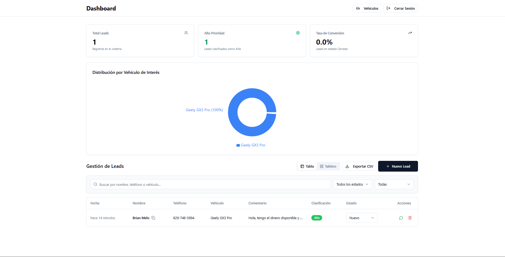
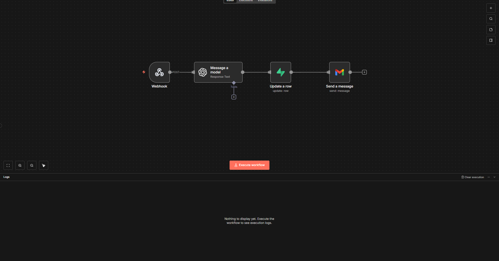
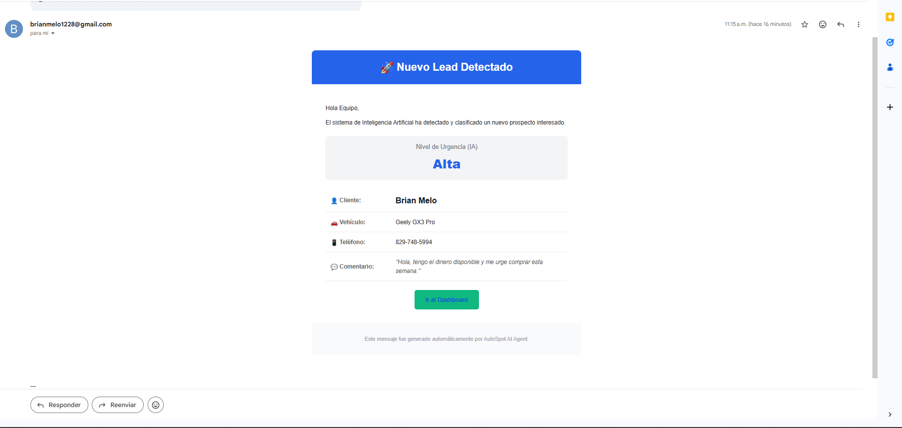
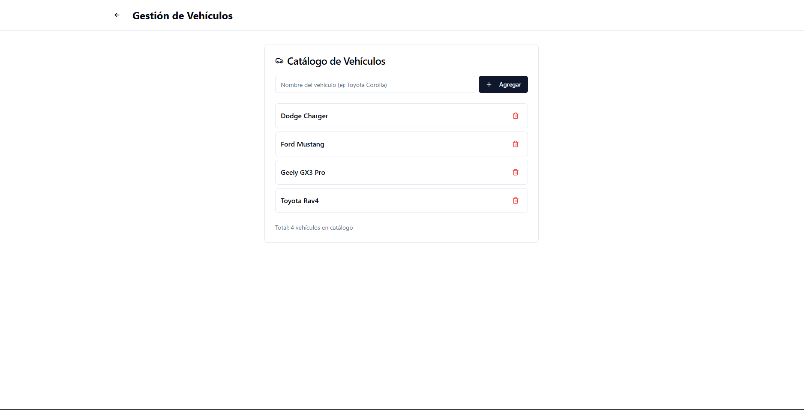

# 🚗 AutoSpot AI - Smart Lead Manager

**Sistema CRM inteligente para concesionarios automotrices con clasificación automática de leads mediante Inteligencia Artificial.**

---

## 📖 Descripción del Proyecto

**AutoSpot AI** es una solución Full Stack diseñada para optimizar el flujo de ventas en agencias de vehículos en República Dominicana. A diferencia de un CRM tradicional, este sistema utiliza un **Agente de IA autónomo** que analiza los comentarios de los clientes en tiempo real para determinar su nivel de urgencia de compra (Alta, Media, Baja).

El objetivo es permitir que los vendedores se enfoquen primero en los clientes listos para comprar ("dinero en mano"), automatizando la cualificación y notificación.

## 🚀 Demo en Vivo

👉 **[Ver Aplicación Desplegada]((https://autospot-brian.lovable.app/dashboard))**
*(Nota: Regístrate con un correo real para probar el flujo de verificación y notificaciones)*

---

## 📸 Capturas de Pantalla

### 1. Dashboard Principal
*Vista general con métricas y tabla Kanban en tiempo real para gestión de estados.*

### 2. Clasificación Automática con IA (n8n)
*Flujo de trabajo backend donde GPT-4o analiza el sentimiento y urgencia del cliente.*

### 3. Notificaciones Inteligentes
*Correo HTML que recibe el gerente con la prioridad ya definida y formateada.*

### 4. Gestión de Inventario
*Módulo dinámico para agregar y eliminar vehículos de la base de datos.*

---

## 🛠️ Stack Tecnológico

### Frontend
- **Framework:** React + Vite
- **Estilos:** Tailwind CSS + Shadcn UI
- **Plataforma:** Lovable (Desarrollo Acelerado)

### Backend & Database
- **BaaS:** Supabase
- **Database:** PostgreSQL
- **Auth:** Supabase Auth (Flujo de confirmación de email)
- **Realtime:** Supabase Realtime (Websockets para actualizaciones en vivo)

### Automatización & IA
- **Orquestador:** n8n (Self-hosted)
- **LLM:** OpenAI GPT-4o-mini
- **Comunicación:** Webhooks & REST API

---

## ✨ Características Principales

### 1. 🧠 Clasificación de Leads con IA
Cuando un cliente se registra, un **Webhook** envía los datos a n8n. Un agente GPT-4o analiza el sentimiento y semántica del mensaje (ej: "tengo el dinero ya") y actualiza la base de datos con una etiqueta de prioridad: **Alta**, **Media** o **Baja**.

### 2. ⚡ Actualizaciones en Tiempo Real
Gracias a **Supabase Realtime**, el Dashboard del vendedor se actualiza instantáneamente cuando la IA termina de procesar, sin necesidad de recargar la página.

### 3. 📧 Notificaciones HTML & WhatsApp
- El sistema envía alertas por correo electrónico con diseño corporativo.
- Incluye botones **Click-to-Chat de WhatsApp** que generan mensajes personalizados para contactar al cliente en un clic.

### 4. 🛡️ Seguridad RLS
Implementación de Row Level Security (RLS) en PostgreSQL para proteger la integridad de los datos, permitiendo acceso seguro a la gestión de inventario y leads.

---

## 🏗️ Arquitectura del Flujo de Datos

El sistema sigue una arquitectura moderna basada en eventos:

1. **Cliente:** Llena formulario en React.
2. **Supabase:** Guarda el lead y dispara Webhook.
3. **n8n:** Recibe datos -> Consulta a OpenAI -> Actualiza Supabase -> Envía Email.
4. **Dashboard:** Recibe el cambio vía WebSocket y muestra la etiqueta "Alta Prioridad" al instante.

---

## 👤 Autor

**Brian Melo**
*Desarrollador Full Stack Jr & Entusiasta de la IA*

---

> *Este proyecto fue desarrollado como parte de una prueba técnica para demostrar competencias en integración de sistemas modernos, automatización y UX.*

> *Este proyecto fue desarrollado como parte de una prueba técnica para demostrar competencias en integración de sistemas modernos, automatización y UX.*
To connect a domain, navigate to Project > Settings > Domains and click Connect Domain.

Read more here: [Setting up a custom domain](https://docs.lovable.dev/features/custom-domain#custom-domain)
